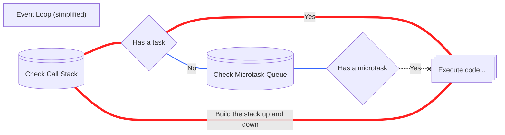

# About

This is an implementation of a `Future` object for vanilla javascript.  
A `Future` extends `Promise` and partially unwraps itself once it is `settled`.  
It improves the reusability of `Promise` objects, without the need to reassign variables or re-`await` it.

# Overview

The initialization is very similar to a `Promise` and has some QoL improvements.  
A `Future` extends `Promise` for 2 reasons:

1. to inherit all the `Promise` methods (e.g. `.then()` or `.catch()`), even from future ES specs.
2. because they are very similar concepts.

> [!IMPORTANT]  
> Requires ES2022 and ESM imports.

Available to install via `npm i @danscode/futures` or `deno install npm:@danscode/futures`.  
You can grab a test file [here](https://github.com/DANser-freelancer/javascript-futures/blob/main/examples.js).

## Initialization and Syntax

The accepted function is run immediately, and a `Future` is returned.  
A `Future` accepts both **regular** and **async** executor functions.

```javascript
const futuro = new Future((resolve, reject, signal) => {
  /*your code*/
});
```

```javascript
const futuroAsincrono = new Future(async (signal) => {
  /*your code*/
});
```

Some handles will be passed to the executor, it depends on the kind of function used as executor:

- These args are always sent, they can be called anything
- Any other args are not available (since the executor is called from a `Future`)
- You can default assign any extra args, as usual `(a, b, c, d = 55) => {}`
- **Regular** executor is wrapped in a `Promise`
  - you can manually `reject()` or `resolve()` it
- **Async** executor implicitly returns a `Promise`
  - you cannot manually settle the async `Promise`
  - it only receives a `signal` arg

A `Future` accepts an options object:

1. `signal` accepts an `AbortSignal` object
   - it is passed to both kinds of executors

## Structure

A `Future` has exposed, **readonly** properties (the object itself remains extensible):

|     Name     | Description                                                             |
| :----------: | :---------------------------------------------------------------------- |
|   `.value`   | is the **settled** value of the underlying `Promise`                    |
|  `abort()`   | is a reference to the method of an `AbortController`                    |
|   `.state`   | mimicks internal slot `[[PromiseState]]`                                |
| `.isPending` | returns `false` for <ins>resolved</ins> or <ins>rejected</ins> `Future` |

#### Details:

<details>
<summary><b>value</b></summary>

- initially `null`
- if <ins>resolved</ins> it is the resolved value
- if <ins>rejected</ins> it is the rejected value
- if <ins>thrown</ins> it is the error object
</details>

<details>
<summary><b>abort</b></summary>

- if no `signal` was passed to the `Future` constructor, it is present but `undefined`.
  - this prevents accidental abort of other dependants when you only meant to abort the one `Future`;
  - also `AbortSignal` has no reference to `AbortController.abort()`, so I can't grab it;
- once the `Future` is <ins>settled</ins>, it is `null` (for memory cleanup).
- see [abort example](#signal-example)
</details>

## Usage

The main use case is to achieve some performance gain by avoiding frequent use of `await`.  
In other words it's like a `const data = new Promise()` with automatic unwrapping.  
`Promise` always has to be unwrapped (even if **already resolved**) with `await` or `.then()` otherwise the value is inaccessible.  
But `await` schedules a <ins>microtask</ins> just like `.then()`:

1. this means every `await` surrenders this iteration of the event loop, because a `microtask` is only <ins>executed between iterations</ins> of the event loop.
2. this also means that an `async` function will be **frozen** untill it <ins>resolves</ins> its first `await` and then the next, and the next...

This is an example of a busy program with the hot path in red:  
_The following diagram implies that promises might also call/contain long tasks_



As you can see, every time you have to `await`, your code takes a [passing loop](https://en.wikipedia.org/wiki/Passing_loop).  
It will only execute after the **entire** call stack has been emptied.

There is one trick to `await` the value at the very last moment, letting the function start other `Promise`s and complete some synchronous setup.

```javascript
async function longTask() {
  const file1 = fileAsync('bunny.png');
  const file2 = fileAsync('carrot.png');
  let number = numberAsync(1);
  // long setup
  for (let i = 0; i < 100000; i++) {
    const x = i * 3;
  }

  // actual use of data
  number = await number;
  return (await file1) + (await file2) + number;
}
```

I find several problems with this approach, specifically in more complicated production grade code.

1. We still can only get the value out by `awaiting` **again**.
   - bad in case we need to use `const file1` more than once;
2. We could reassign `let number` to the once `awaited` value.
   - but it's very easy to reassign it somewhere else by accident;
3. We could start all `Promise`s with `Promise.all()`.
   - but now it's another `Promise` which has to be unwrapped with an `await`;
     - and possibly destructured into more variables.
   - it doesn't work if there are more `async` tasks dependent on the result of some initial `Promise`s;
     - especially if those secondary `Promise`s are best awaited at different points in the function.

`Future` removes the need for tricks.  
Once a `Future` is created, you only need to `await` it **once** to receive the value.  
Any later access is direct and **synchronous** via `<future>.value`.  
A `Future` also integrates with `AbortSignal` in two ways:

1. you can pass an `AbortController.signal` object in the `Future` constructor options
2. or an `AbortController` will be created
   - this makes sure the `AbortSignal` is always passed into executors
   - and exposes the `.abort()` method on the `Future` itself

<a id="signal-example"></a>
Here is an example of how to use it:

```javascript
const cancelledFuture = new Future((res, rej, signal) => {
  signal.addEventListener(
    'abort',
    () => {
      rej(signal.reason);
    },
    { once: true }
  );
  // never resolves
  setTimeout(() => {
    res(200);
  }, 1500);
});

try {
  cancelledFuture.abort(`I don't want this`);
  log(await cancelledFuture);
} catch (e) {
  console.log(e);
}
```

# Contributors

[Dan](https://github.com/DANser-freelancer): Code author

### Changelog

<details>
<summary>1.1.2 -> 2.0.0</summary>

- improved natural/derived **async** function detection
- changed `<future>.v` to `<future>.value`
</details>
